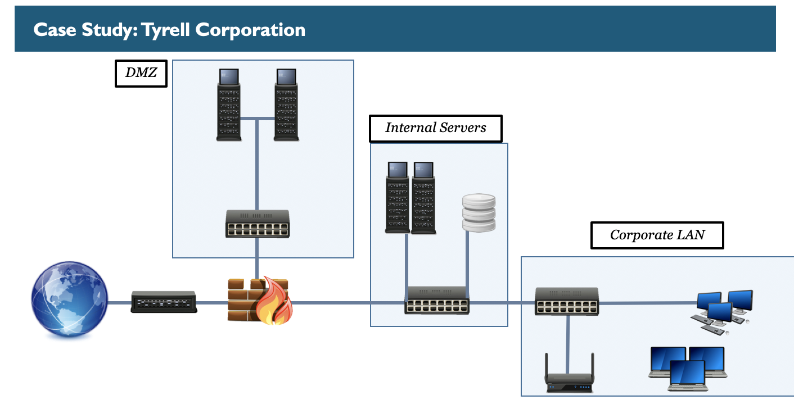
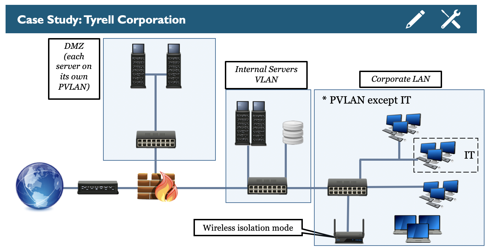

As discussed, we are going to use Tyrell Corp. to illustrate some of the issues and solutions proposed throughout this class, and to frame some of the discussions we will have during the week. This is what Tyrell’s network looks like today. 

Like many organizations they have very little segmentation in place, with only 3 zones defined: INTERNET, DMZ and LAN. 
Notice how the internal servers and the corporate LAN are effectively on the same segment, only connected to 2 different switches. The internal servers include domain controllers and databases that may contain confidential information and that may be critical to Tyrell’s business. 

Can anything go wrong with this approach? 

This is Tyrell Corp. network after applying layer 2 mitigations at the end of Day 1

