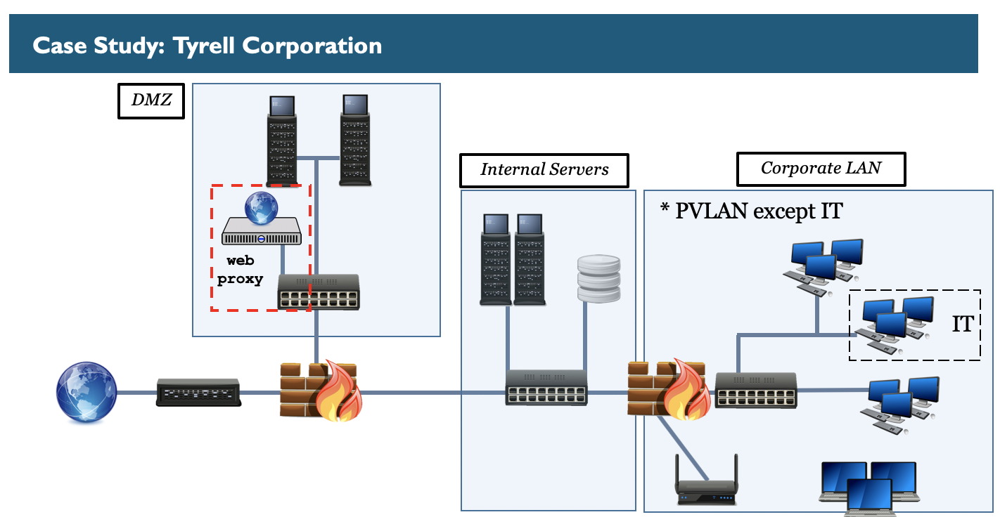
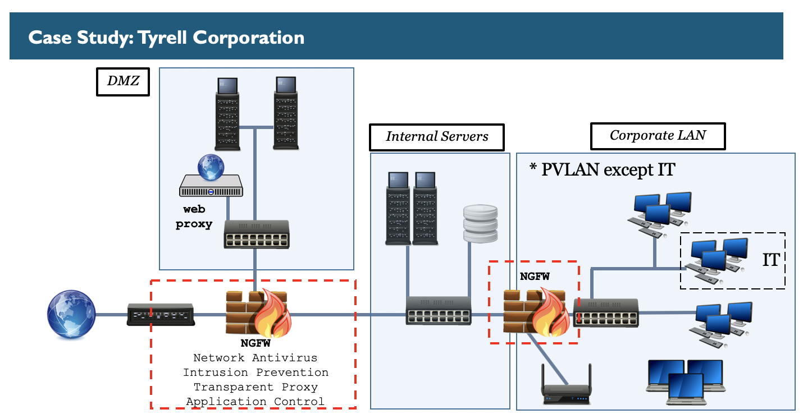
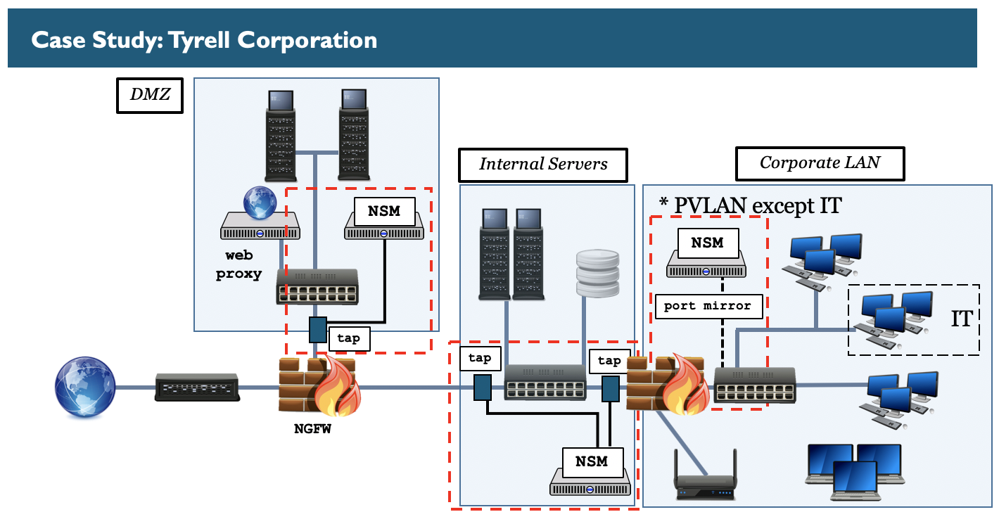
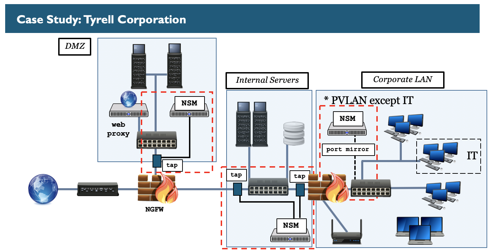
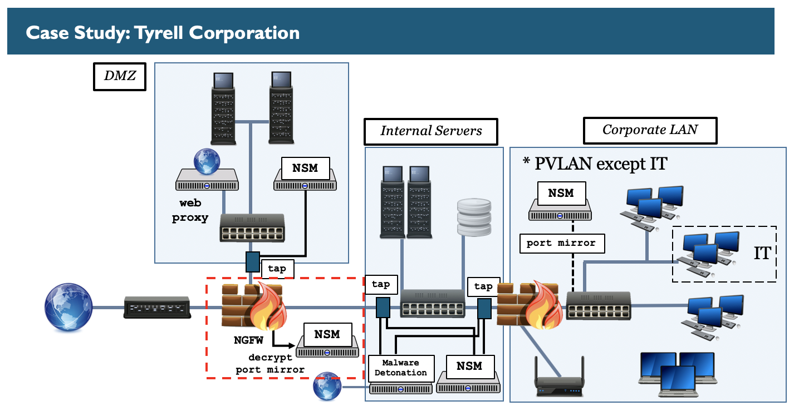
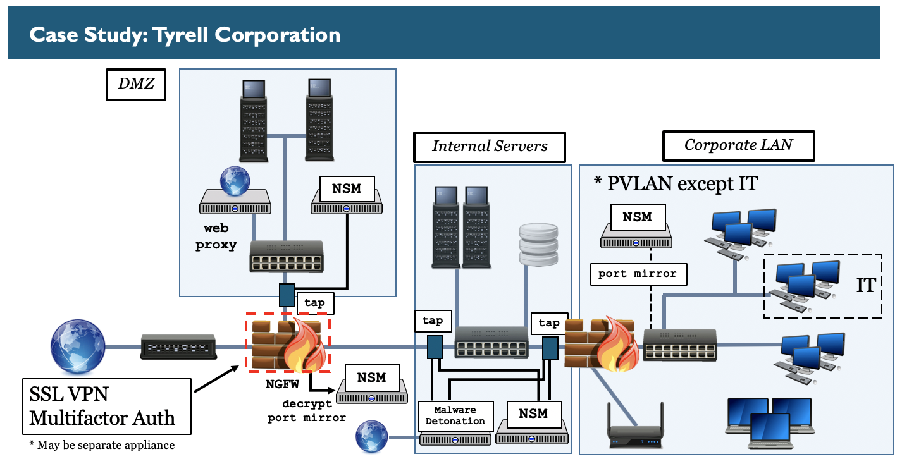
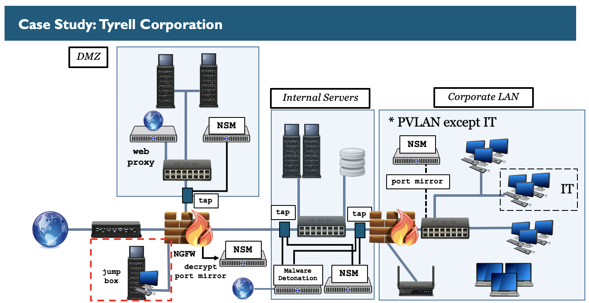
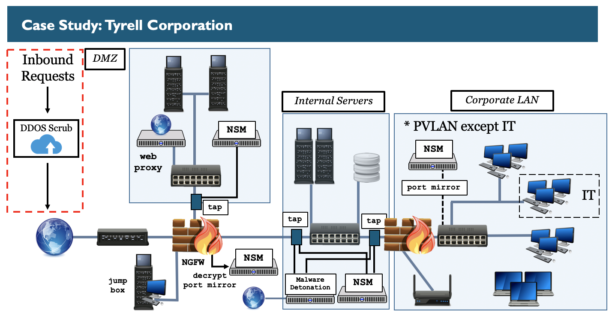

This diagram shows the addition of an explicit web proxy to the Tyrell Corporation architecture. In this example, web requests going outbound to the internet should come from the explicit web proxy.

This diagram shows an adjustment in that the firewall is now a Next-Generation Firewall. In this example, the edge firewall is a NGFW and so is the internal firewall.

This diagram shows the addition of multiple Network Security Monitor sensors to the Tyrell Corporation architecture. In this example, a sensor is in the DMZ with a tap sending a copy of traffic to it. Another sensor is within the internal server zone using network taps to receive traffic. Also, a sensor is in the corporate LAN zone with network traffic being received from a port mirror.

This diagram shows the addition of a malware detonation device to the Tyrell Corporation architecture. In this example, content can be submitted to the malware detonation device as well as automatically extracted through network traffic visible from network taps.

This diagram shows the addition of a decrypt port mirror and Network Security Monitor sensor to the Tyrell Corporation architecture. In this example, this allows for TLS traffic to be decrypted for the NGFW to inspect data and then a copy of the decrypted data to be sent to a Network Security Monitor.

This diagram shows the addition of a SSL VPN with multifactor authentication requirements to the Tyrell Corporation architecture. In this example, users can remotely connect into the environment using the SSL VPN with multifactor authentication.

Addition of a jump box in a separate segment.

This diagram shows the addition of DDOS protection to the Tyrell Corporation architecture. In this example, requests to inbound services such as web services in the DMZ are routed through a DDOS scrubbing cloud service.

