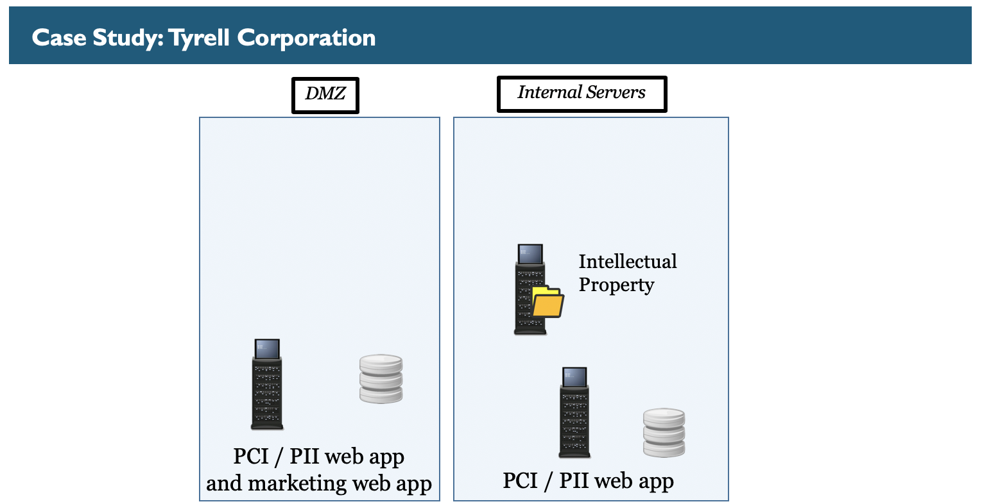
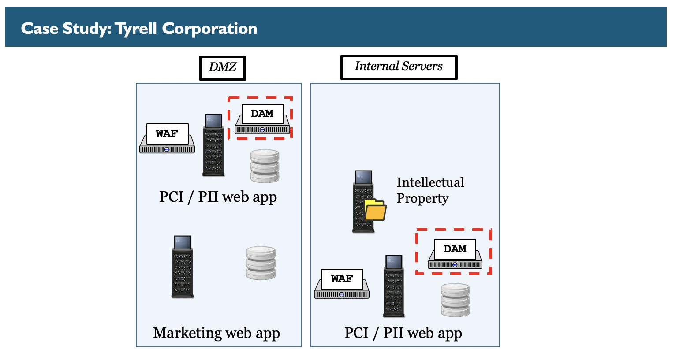
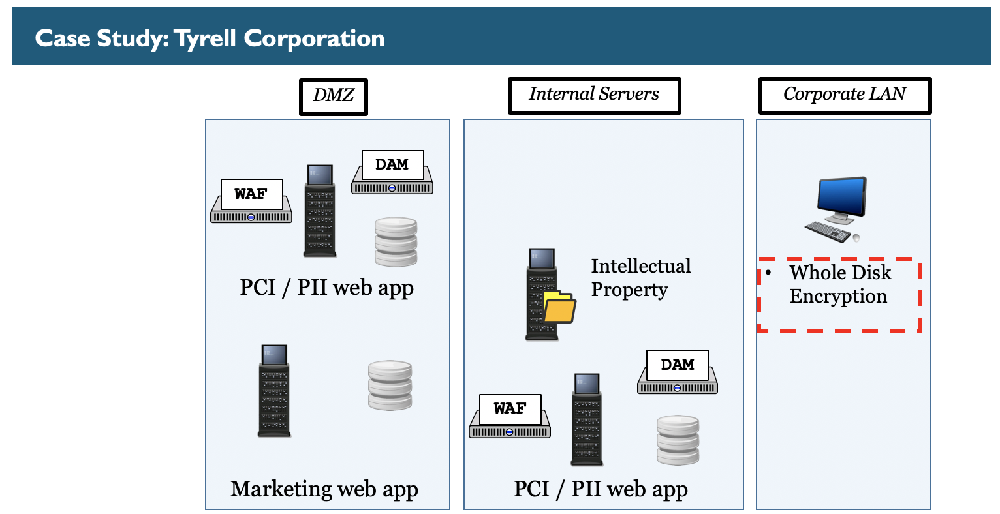
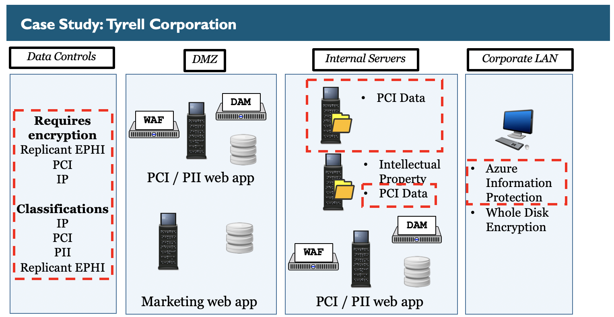
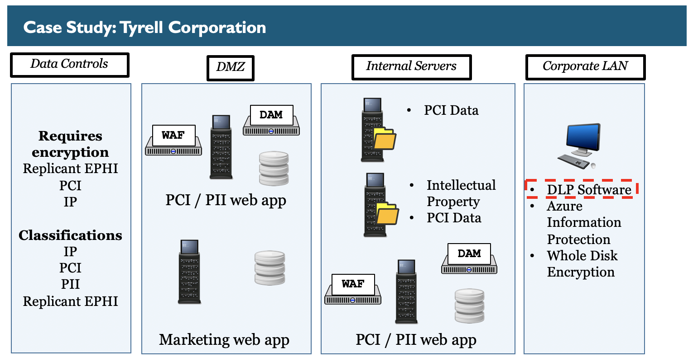
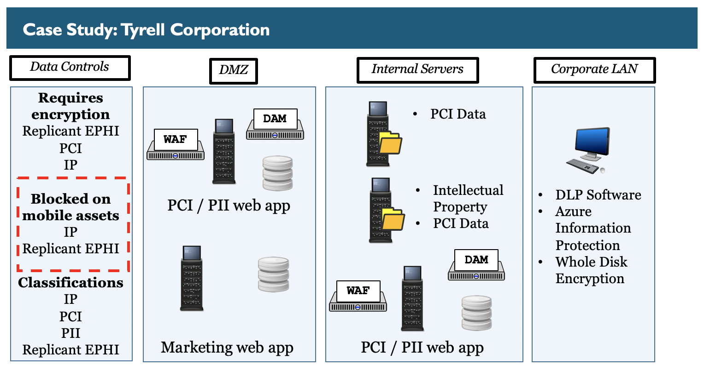
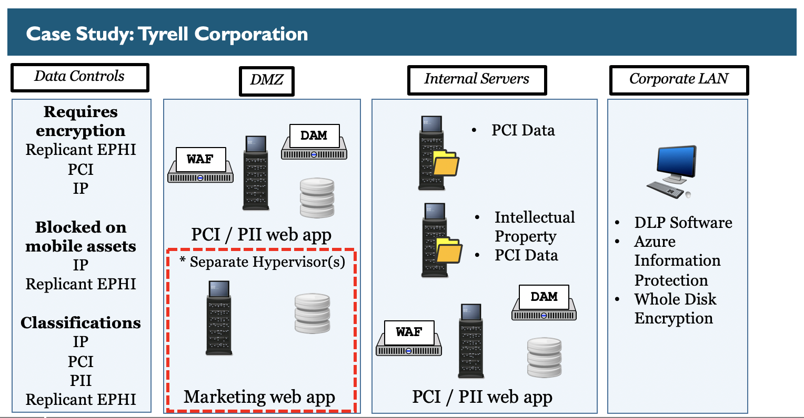

Tyrell Corporation Case Study 
========

Day 4
---------

This diagram represents the Tyrell Corporation's data-centric design at the beginning of book four. The layout is simple. A single web server handles credit card information as well as a marketing site to the public internet. Internally, there is a file server that contains sensitive intellectual property on all the details about replicant creation. Finally, there is an internal web application that also handles credit card information as well as standard personally identifiable information or PII.

This diagram shows the addition of web application firewalls to the Tyrell Corporation architecture. In this example, requests to the web servers that manage PCI data must go through a WAF. Also, notice that in the DMZ there now are two web servers and database servers. In this case, the organization split the PCI data from the marketing web application. This was done for multiple reasons:

- Separate systems based on different data sensitivity levels
- Implement security controls against key data rather than universally
- Minimize management and maintenance of security controls

This diagram shows the addition of database activity monitors to the Tyrell Corporation architecture. In this example, requests to the database servers that manage PCI data must go through or be monitored by a DAM. 

This diagram shows the addition of whole disk encryption to endpoint systems at Tyrell. This is to protect potential sensitive data that has been copied to the systems as well as to protect against bootkits.

This diagram shows the addition of file classification and discovery to Tyrell. During the discovery phase, PCI data was identified on the file server that hosts intellectual property and it was also found on another file server. Because of these findings, Tyrell is more focused on properly identified sensitive data, classifying it, and putting controls against it. To that end Azure Information Protection is being used in conjunction with Windows File Classification. The following classification levels are being utilized:

IP = Intellectual Property
PCI = Payment Card Industry
PII = Personably Identifiable Information
Replicant EPHI = Replicant Electronic Protected Health Information (Replicants are not humans therefore replicant EPHI has no official laws. Instead it is protected by Tyrell to better protect intellectual property)

This diagram shows the addition of Data Loss Prevention to endpoint systems at Tyrell. This is to protect potential sensitive data that has been copied to the systems by either moving it or enforcing controls around it.

This diagram shows the addition of mobile device management to mobile devices at Tyrell. This is to protect mobile assets and to secure or keep certain data from ever entering mobile devices.

This diagram shows the addition of a new hypervisor cluster at Tyrell. Because systems have different risk levels, zones of trust, and different data sensitivity levels Tyrell decided it is safer to place certain non-sensitive assets on one group of hypervisors and other sensitive assets on another group of hypervisors.

