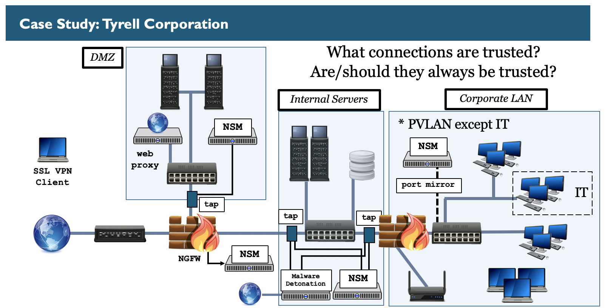
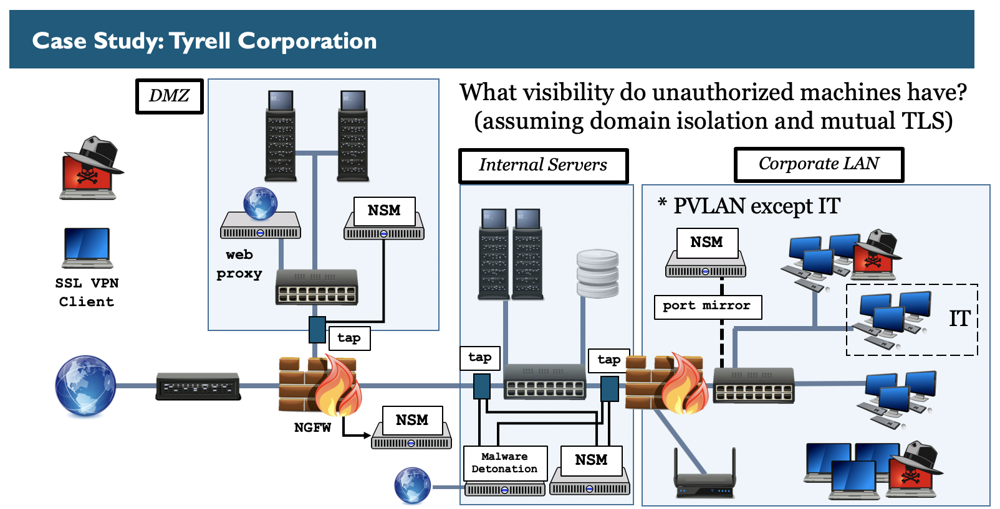
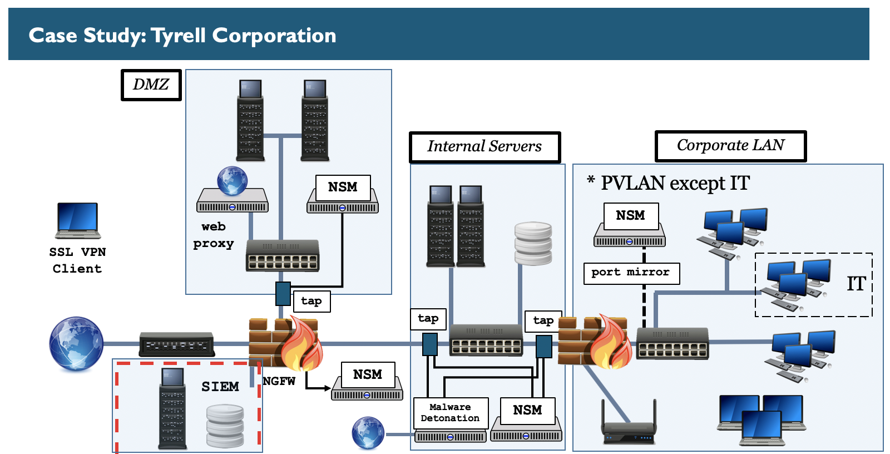

Tyrell Corporation Case Study 
========

Day 5
---------

This diagram represents the Tyrell Corporation's design. Internal to the organization there are servers and workstations. External to the organization are laptops and mobile devices that connect via a SSL VPN to access internal resources.

This diagram represents the Tyrell Corporation's design. In it, a SIEM platform has been added and is hanging off the firewall as a dedicated zone. The SIEM platform will be utilized to gather data from endpoints, network devices, and security controls. Once the data is centralized, it will be enriched to add automatic context and then will be reviewed to find unauthorized activity and anomalies.

